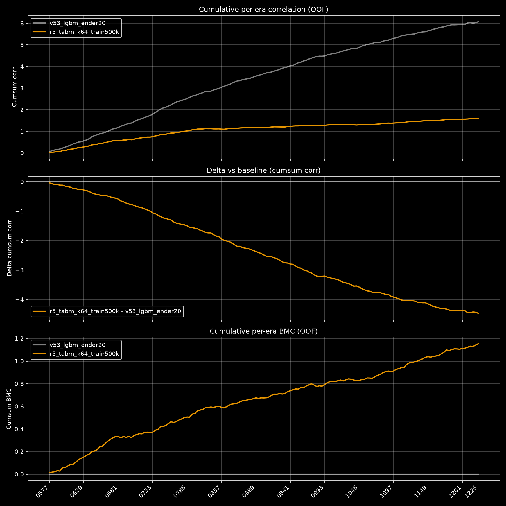

# Ender-20 Neural Architecture Search (v5.3)

**Date:** 2026-08-02

## Abstract

This six-round search compared tapered MLP, tabular ResNet, and TabM neural
architectures for `target_ender_20` on Numerai v5.3. Selection prioritized
out-of-fold Benchmark Model Contribution (BMC) against
`v53_lgbm_ender20`, rather than raw target correlation alone. The strongest
scout run is a benchmark-residual TabM with 64 members, three 512-wide ReLU
blocks, all 3,555 features, and a 500,000-row training cap. It reaches
0.007185 full-period BMC with 0.7343 BMC Sharpe. Seed and sampled-row checks
confirm the architecture direction but also show that the exact point estimate
is not production-stable. This is therefore a scout winner, not a deployment
gate: confirmation still requires consecutive-era full-data OOF evaluation.

## Research question

Which practical neural architecture produces the strongest out-of-fold signal for
`target_ender_20`, prioritizing Benchmark Model Contribution against
`v53_lgbm_ender20` rather than raw target correlation alone?

## Baseline and protocol

- Baseline/reference: official `v53_lgbm_ender20` predictions. The repository's
  deep all-feature LightGBM config is the conceptual baseline; the official model
  is the scoring reference and avoids an intractable 30,000-tree local replay.
- Data: v5.3 all-feature set (3,555 features), every fourth era for scouting.
- Fold universe: rows/eras covered by `v53_lgbm_ender20` only, applied to raw
  and residual configs alike. BMC cannot score the earlier uncovered eras.
- Target: explicit `target_ender_20` (`target` is currently equal, but the alias is
  not relied upon).
- Outer validation: five expanding era splits with a 13-era embargo. The first
  empty-training fold is skipped by the shared pipeline.
- Inner early stopping: most recent 10% of training eras with its own 13-era
  embargo.
- Initial scout cap: 250,000 training rows per outer fold; later bounded scale
  checks use 500,000 and 750,000. Validation rows are never sampled.
- Primary stored metric: `bmc_last_200_eras.mean`; tie-breaker: full-period
  `bmc.mean`. Because the scout retains every fourth era, a separate corrected
  last-50-retained-era table is used for an approximately 200-week recent view.
- Guardrails: inspect `corr.mean`, BMC Sharpe/drawdown, and
  `avg_corr_with_benchmark`.

The scout follows the repository's downsampled deep-baseline convention and
therefore counts the embargo in retained eras: 13 retained eras are roughly 52
original eras. This is deliberately conservative and keeps the architecture
comparison baseline-aligned, but absolute scout scores are not a substitute for
the final consecutive-era run. Likewise, "last 200" here means the last 200
retained eras (roughly every fourth original era), so both full-period and
most-recent-fold behavior must be inspected.

## Hypothesis and motivation

Repository history contains a v5.2 search whose best result was a large
residual-only GELU MLP (`1536-1024-768-512-256`, BMC 0.005079). That result used
older data and unavailable OOF baseline predictions, so it is an incumbent rather
than current evidence. This experiment ports the safe parts of that model and
compares them under one v5.3 protocol with:

1. A tabular residual network.
2. TabM, a parameter-efficient ensemble of MLPs.
3. Raw-target controls for both the historical MLP and TabM.

The residual variants learn an era-wise linear residual to the official benchmark
and emit the neural residual only. This directly targets signal uniqueness/BMC.

## Round 1 plan

| config | architecture | training target | key settings |
| --- | --- | --- | --- |
| `r1_mlp_big_residual` | tapered MLP | benchmark residual | GELU, 8.35M params, no dropout |
| `r1_mlp_big_raw` | tapered MLP | raw Ender-20 | target-objective control |
| `r1_resnet_residual` | tabular ResNet | benchmark residual | 4 residual blocks, width 512 |
| `r1_tabm_residual` | TabM | benchmark residual | k=16, 3x512, ReLU |
| `r1_tabm_raw` | TabM | raw Ender-20 | target-objective control |

## Results

The first `r1_mlp_big_residual` launch stopped before epoch 1 because the
unfiltered scout begins at era 0001 while benchmark residual labels begin at
era 0158. The earliest expanding fold then had only eight finite-label eras and
the 13-retained-era inner embargo correctly failed closed. The protocol was
repaired by filtering every Round-1 config to benchmark-covered rows *before*
fold construction; this yields one shared, scoreable era universe instead of
special-casing the residual models. No metric was produced by the failed launch.

### Round 1 metrics

| model | bmc mean | bmc last 200 | corr mean | corr with benchmark | bmc sharpe | max drawdown |
| --- | ---: | ---: | ---: | ---: | ---: | ---: |
| `r1_mlp_big_residual` | **0.004837** | **0.004372** | 0.008464 | 0.062161 | 0.5233 | 0.095419 |
| `r1_mlp_big_raw` | -0.001024 | -0.001225 | 0.005116 | 0.160831 | -0.0860 | 0.359296 |
| `r1_resnet_residual` | 0.000779 | 0.000090 | **0.010964** | 0.262331 | 0.0755 | 0.251603 |
| `r1_tabm_residual` | 0.003503 | 0.002956 | **0.011013** | 0.174032 | 0.2938 | 0.102024 |
| `r1_tabm_raw` | 0.000204 | 0.000277 | **0.015188** | 0.388521 | 0.0200 | 0.129482 |

The large MLP restored epochs 1, 2, 1, and 1 across the four usable outer
folds. Training loss continued falling while validation loss degraded sharply,
so it is a strong BMC incumbent but over-parameterized or over-updated for the
250k-row scout cap. The remaining Round-1 architectures will test whether
parameter sharing/residual structure improves this generalization gap.

The raw-target control loses on every primary statistic. Residualization is not
merely trading raw corr for uniqueness here: it improves both corr and BMC while
cutting benchmark similarity. Subsequent architecture selection should therefore
stay on the residual objective; the raw TabM control remains useful to check that
this conclusion is architecture-independent.

The residual ResNet raises raw target corr above the MLP, but its much higher
benchmark similarity removes most of that value under BMC. It is especially weak
over the retained last-200 window, so this capacity/depth is not a viable BMC
winner even though it is a better conventional correlation model.

TabM is a much stronger BMC challenger than the ResNet and has the best raw corr
so far, but its averaged ensemble remains more benchmark-like than the tapered
MLP. Consequently it trails the MLP by 0.001334 full-period BMC and 0.001416 on
the retained last-200 window.

Raw TabM confirms that target corr alone is the wrong selection criterion for
this research question: it has Round 1's highest corr, but almost all of that
signal is benchmark-like and BMC is effectively zero.

### Round 1 fold check and decision

| outer fold | MLP residual BMC | TabM residual BMC | difference |
| ---: | ---: | ---: | ---: |
| 1 | 0.006900 | 0.005712 | +0.001188 |
| 2 | 0.002728 | 0.001549 | +0.001179 |
| 3 | 0.002907 | 0.002560 | +0.000347 |
| 4 (most recent) | 0.006743 | 0.004168 | +0.002575 |

The MLP beats TabM in every outer fold. Across all 214 paired OOF eras, its mean
BMC advantage is 0.001334 (standard error 0.000723; positive on 52.3% of eras).
This is consistent enough to focus Round 2 on the MLP family, while retaining
TabM as the strongest alternative.

## Round 2 plan

Round 2 keeps the incumbent and changes one variable per variant:

| config | single change | rationale |
| --- | --- | --- |
| `r1_mlp_big_residual` | incumbent | current best |
| `r2_mlp_lr_5e4` | LR 0.0005 | reduce epoch-1 overfit |
| `r2_mlp_lr_3e4` | LR 0.0003 | map the lower-LR range |
| `r2_mlp_narrow` | 1024-768-512-256 | test excess capacity |
| `r2_mlp_partial_residual_075` | residual proportion 0.75 | trade uniqueness for target signal |

### Round 2 metrics

| model | bmc mean | bmc last 200 | corr mean | corr with benchmark | bmc sharpe | max drawdown |
| --- | ---: | ---: | ---: | ---: | ---: | ---: |
| `r1_mlp_big_residual` | **0.004837** | **0.004372** | **0.008464** | 0.062161 | **0.5233** | **0.095419** |
| `r2_mlp_lr_5e4` | 0.003235 | 0.003114 | 0.006404 | 0.073162 | 0.3700 | 0.121241 |
| `r2_mlp_lr_3e4` | 0.003021 | 0.003280 | 0.006757 | 0.080668 | 0.3029 | 0.246493 |
| `r2_mlp_narrow` | 0.002975 | 0.003404 | 0.004852 | **0.051130** | 0.2768 | 0.173213 |
| `r2_mlp_partial_residual_075` | 0.001289 | 0.001572 | 0.004118 | 0.065517 | 0.1277 | 0.117048 |

Round 2 did not improve the incumbent. Both lower learning rates reduced BMC,
and their early-stopping diagnostics still selected epoch 1 in nearly every
fold. The 4.95M-parameter narrow MLP also trailed the 8.35M-parameter incumbent,
so the wider taper is earning its extra capacity under this scout protocol.
Finally, blending 25% of the raw target back into the residual objective caused
the largest BMC loss and did not improve raw correlation. The pure benchmark
residual remains the correct objective for this search.

## Round 3 plan

Round 3 is the second plateau check. It keeps the protocol and incumbent fixed
and tests the strongest remaining architecture/generalization hypotheses one at
a time:

| config | single change | rationale |
| --- | --- | --- |
| `r1_mlp_big_residual` | incumbent | current best |
| `r3_mlp_dropout_005` | dropout 0.05 | mild regularization for epoch-1 overfit |
| `r3_mlp_silu` | SiLU activation | strongest historical alternate activation |
| `r3_mlp_depth4` | remove the 256-wide stage | isolate depth while retaining 98% of parameters |
| `r3_mlp_train500k` | training cap 500k | test whether the wide model is data-limited |
| `r3_tabm_k32` | TabM ensemble k=32 | evaluate TabM's official default ensemble size |

The five challenger executions make this pass one model wider than the usual
four-config round because `r3_tabm_k32` is an architecture-calibration check,
not another MLP tuning direction. It corrects the Round-1 TabM ensemble from
the compute-saving k=16 scout value to the library's recommended k=32 default.

### Round 3 metrics

| model | bmc mean | bmc last 200 | corr mean | corr with benchmark | bmc sharpe | max drawdown |
| --- | ---: | ---: | ---: | ---: | ---: | ---: |
| `r1_mlp_big_residual` | 0.004837 | 0.004372 | 0.008464 | 0.062161 | 0.5233 | 0.095419 |
| `r3_mlp_dropout_005` | 0.002766 | 0.002515 | 0.001010 | -0.049451 | 0.3025 | 0.110492 |
| `r3_mlp_silu` | 0.003083 | 0.003021 | 0.002591 | -0.008484 | 0.3865 | **0.039298** |
| `r3_mlp_depth4` | 0.002483 | 0.001812 | 0.005291 | 0.078592 | 0.2137 | 0.097633 |
| `r3_mlp_train500k` | 0.004180 | 0.003669 | 0.003275 | -0.024224 | 0.4456 | 0.101471 |
| `r3_tabm_k32` | **0.005089** | **0.004827** | **0.008715** | 0.077233 | **0.5354** | 0.088487 |

TabM-k32 is the first challenger to beat the large MLP on both selection
metrics. Relative to the MLP it gains 0.000252 full-period BMC and 0.000455 on
the retained last-200 window. The lead is not yet robust: its paired era
standard errors are 0.000708 and 0.000735 respectively, and it wins outer folds
2-3 while losing folds 1 and 4. In contrast, k32's gain over TabM-k16 is larger
(+0.001586 full, +0.001871 last-200) and holds in three of four folds. Round 4
therefore treats k32 as provisional and tests seed stability plus TabM capacity.

The MLP variants all lose. Mild dropout, SiLU, and removing the last bottleneck
reduce BMC. Increasing the MLP training cap to 500k improves validation loss but
also lowers BMC, so the 250k cap is not concealing a stronger wide-MLP result.

### Frozen exploratory blends

Two era-rank blend formulas were inspected after Round 3 and are frozen before
any Round-4 output is seen. They are secondary candidates, not standalone
architecture evidence:

| blend | bmc mean | bmc last 200 | bmc sharpe | max drawdown |
| --- | ---: | ---: | ---: | ---: |
| 50% TabM-k32 + 50% MLP | 0.005621 | 0.005112 | 0.6144 | **0.038872** |
| 50% TabM-k32 + 25% MLP + 25% narrow MLP | 0.005470 | **0.005261** | 0.5910 | 0.052873 |

These weights were discovered on the same OOF predictions they summarize, so
they must be confirmed on a new seed or consecutive-era gate before promotion.

## Round 4 plan

| config | single change | rationale |
| --- | --- | --- |
| `r4_tabm_k32_seed2027` | k32 model seed 2027 | direct winner robustness |
| `r4_tabm_k16_seed2027` | k16 model seed 2027 | matched-seed attribution of k gain |
| `r4_tabm_k64` | ensemble k=64 | test continuation of ensemble-size scaling |
| `r4_tabm_width768` | block width 768 | test base-model capacity independently of k |

The training-row sampling seed remains 1337 in both model-seed replications, so
only initialization and minibatch order change. K64 keeps batch sizes fixed; an
out-of-memory error will fail closed rather than silently confounding the test.

### Round 4 metrics

| model | bmc mean | bmc last 200 | corr mean | corr with benchmark | bmc sharpe | max drawdown |
| --- | ---: | ---: | ---: | ---: | ---: | ---: |
| `r1_mlp_big_residual` | 0.004837 | 0.004372 | 0.008464 | 0.062161 | 0.5233 | 0.095419 |
| `r3_tabm_k32` | 0.005089 | 0.004827 | 0.008715 | 0.077233 | 0.5354 | 0.088487 |
| `r4_tabm_k32_seed2027` | 0.005462 | 0.005297 | 0.006058 | -0.010599 | 0.5967 | 0.038818 |
| `r4_tabm_k16_seed2027` | 0.005170 | 0.004919 | **0.010285** | 0.096606 | 0.4929 | 0.077118 |
| `r4_tabm_k64` | **0.006739** | **0.006277** | 0.008517 | 0.034243 | **0.6639** | **0.032043** |
| `r4_tabm_width768` | 0.005196 | 0.004997 | 0.008873 | 0.064401 | 0.5298 | 0.063960 |

The matched seed-2027 pair preserves k32's advantage over k16 (+0.000292 full,
+0.000378 last-200), so the ensemble-size direction is not unique to seed 1337.
K64 then produces the largest jump in the search: +0.001650 full and +0.001451
last-200 over same-seed k32. It beats the large MLP by +0.001902 full and
+0.001905 last-200, with better Sharpe and drawdown and without high benchmark
similarity. Width 768 does not help, indicating that member count rather than a
larger shared backbone is the useful capacity axis.

K64's lead is not fully uniform over time. It beats the MLP in folds 1-3 but
trails by 0.000644 in the most recent fold; relative to seed-2027 k32 it is ahead
in folds 1-2 and approximately tied in folds 3-4. Round 5 therefore prioritizes
both model-seed and sampled-row robustness before scale-up.

## Round 5 plan

| config | single change | rationale |
| --- | --- | --- |
| `r5_tabm_k64_seed2027` | model seed 2027 | direct k64 replication |
| `r5_tabm_k64_sample_seed2027` | row-sample seed 2027 | test 250k sample dependence |
| `r5_tabm_k96` | ensemble k=96 | map ensemble-size saturation |
| `r5_tabm_k64_train500k` | training cap 500k | bounded scale/generalization check |

The two seed tests isolate different randomness sources: the model-seed run
keeps sampled rows fixed, while the sample-seed run keeps model initialization
fixed. K96 and the 500k run preserve all batch and optimizer settings.

### Round 5 metrics

| model | bmc mean | bmc last 200 | corr mean | corr with benchmark | bmc sharpe | max drawdown |
| --- | ---: | ---: | ---: | ---: | ---: | ---: |
| `r4_tabm_k64` | 0.006739 | 0.006277 | 0.008517 | 0.034243 | 0.6639 | **0.032043** |
| `r5_tabm_k64_seed2027` | 0.005998 | 0.005869 | 0.009205 | 0.061924 | 0.6400 | 0.047133 |
| `r5_tabm_k64_sample_seed2027` | 0.005083 | 0.004505 | **0.011025** | 0.127232 | 0.4752 | 0.049753 |
| `r5_tabm_k96` | 0.006570 | 0.006236 | 0.008294 | **0.025791** | 0.6533 | 0.047923 |
| `r5_tabm_k64_train500k` | **0.007185** | **0.006754** | 0.010689 | 0.063635 | **0.7343** | **0.032043** |

K64 remains stronger than k32 under a second model seed, establishing the
architecture direction even though seed 1337 is the better realization. The
alternate 250k row sample causes a broad BMC loss in folds 2-4 while increasing
raw correlation and benchmark similarity; this is a genuine sampling-risk
signal, not a better model. K96 is effectively tied with but does not surpass
k64, so ensemble-size performance is locally saturated around k=64.

The 500k cap is the new point-estimate winner. Its +0.000445 full and +0.000477
last-200 improvements over 250k are statistically uncertain and concentrated in
fold 2 (fold deltas 0.000000, +0.001429, +0.000416, -0.000045). It is therefore
provisional until the two randomness sources are retested at 500k.

## Round 6 plan

| config | single change | rationale |
| --- | --- | --- |
| `r6_tabm_k64_train500k_seed2027` | model seed 2027 | replicate the winning cap |
| `r6_tabm_k64_train500k_sample_seed2027` | row-sample seed 2027 | isolate recent-fold sample risk |
| `r6_tabm_k96_train500k` | ensemble k=96 | test k-by-data interaction |
| `r6_tabm_k64_train750k` | training cap 750k | bounded data-saturation test |

At 500k, folds 1-2 use all available rows, so the sample-seed variant changes
only folds 3-4 and provides exact early-fold controls. A 750k cap nearly exhausts
fold 3 and adds 250k rows to both still-capped folds while retaining safe memory
headroom on the eager scout path.

### Round 6 metrics

All values in this table are stored full-period metrics except the explicitly
named retained-last-200 BMC column.

| model | full BMC | retained-last-200 BMC | full target Corr | full corr with benchmark | full BMC Sharpe | full max drawdown |
| --- | ---: | ---: | ---: | ---: | ---: | ---: |
| `r5_tabm_k64_train500k` | **0.007185** | **0.006754** | 0.010689 | **0.063635** | **0.7343** | **0.032043** |
| `r6_tabm_k64_train500k_seed2027` | 0.005808 | 0.005665 | **0.012812** | 0.153057 | 0.6043 | 0.047133 |
| `r6_tabm_k64_train500k_sample_seed2027` | 0.006730 | 0.006268 | 0.011255 | 0.101274 | 0.6490 | 0.045670 |
| `r6_tabm_k96_train500k` | 0.006411 | 0.006066 | 0.011235 | 0.094570 | 0.6311 | 0.047923 |
| `r6_tabm_k64_train750k` | 0.006862 | 0.006409 | 0.011013 | 0.076504 | 0.6993 | **0.032043** |

The 500k incumbent survives every Round-6 challenge. The model-seed replication
raises raw target Corr but loses BMC and becomes much more benchmark-like. The
alternate row sample is closer on full-period BMC than its 250k counterpart,
showing that more rows reduce sampling sensitivity, but it still loses and its
recent behavior is weak. K96 does not reveal a favorable ensemble-size by data
interaction. Finally, 750k loses 0.000322 full BMC and 0.000345 retained-last-200
BMC to 500k. Additional scout rows are therefore not a promotion signal.

## Corrected recent-window validation

The stored JSONs mix a retained-last-200 BMC window with full-period Corr,
Sharpe, and drawdown fields. To avoid that presentation trap, all five metrics
below were independently recomputed on one common window: the last 50 retained
eras (`1029` through `1225`, every fourth era), covering 322,287 rows and roughly
200 original weekly eras. All 50 observations belong to outer fold 4.

| residual candidate | recent BMC | recent target Corr | recent BMC Sharpe | recent max drawdown | recent corr with benchmark |
| --- | ---: | ---: | ---: | ---: | ---: |
| `r1_mlp_big_residual` | **0.006648** | 0.005140 | 0.7999 | **0.015047** | -0.098991 |
| `r5_tabm_k64_seed2027` (250k) | 0.006556 | 0.005289 | **0.9332** | 0.022747 | -0.081764 |
| `r5_tabm_k64_train500k` | 0.006418 | **0.005665** | 0.8951 | 0.015317 | -0.047168 |
| `r6_tabm_k64_train500k_seed2027` | 0.006345 | 0.005482 | 0.8635 | 0.028237 | -0.047326 |
| `r6_tabm_k64_train500k_sample_seed2027` | 0.003880 | 0.007426 | 0.4000 | 0.045670 | 0.114894 |
| `r6_tabm_k96_train500k` | 0.005627 | 0.003386 | 0.6961 | 0.032149 | -0.110906 |
| `r6_tabm_k64_train750k` | 0.006064 | 0.004155 | 0.9268 | 0.025221 | -0.092784 |

The MLP has the highest recent BMC by a small margin, but its full-period BMC,
Sharpe, and drawdown are materially worse. The 500k K64 run is the best balanced
point candidate across full and recent evidence. Its sample-seed replication's
recent collapse is the clearest remaining risk, so neither this exact seed nor a
same-OOF blend should be promoted without a new consecutive-era gate.

Direct-target controls have different prediction semantics and are reported
separately. Among the direct-target models actually tested, raw TabM-k16 has the
best full target Corr (0.015188), but full BMC is only 0.000204. On the corrected
recent window it has target Corr 0.008593, BMC -0.000768, and benchmark Corr
0.340781. It is a useful conventional target predictor, not the best unique
Numerai signal.

Every reported OOF artifact contains 1,279,658 unique IDs over 214 retained eras.
Strict validation found no null scoring fields, duplicate IDs, missing benchmark
IDs, or era mismatches. Recomputing both the 500k winner and 750k scale check
reproduced every saved JSON metric exactly.

## Final decision

**Scout winner:** `r5_tabm_k64_train500k`.

- Architecture: TabM, `k=64`, three 512-wide ReLU blocks, dropout 0.1.
- Inputs: all 3,555 v5.3 features, centered by 2 and scaled by 2.
- Objective: per-era intercept-fitted residual to `v53_lgbm_ender20`; stored
  predictions are the neural residual signal, not reconstructed target values.
- Optimization: batch 1,024, learning rate 0.002, weight decay 0.0003, recent-era
  inner early stopping with a 13-retained-era embargo.
- Data cap: 500,000 training rows per capped outer fold, sample seed 1337.

**Assessment: share with caveats.** The architecture direction is supported by
multiple capacities and seeds, but the exact score is seed- and sample-sensitive.
The scout uses every fourth era, and its 13-retained-era embargo corresponds to
roughly 52 original weeks. It is not evidence for staking or deployment by itself.

The full benchmark-covered, all-feature disk store was built successfully
(6,195,697 rows, 3,555 features), providing a bounded-memory path for the required
consecutive-era confirmation. At the time this scout section was frozen, no
full-data winner run or model upload was claimed; the later confirmation is
documented in the deployment addendum below.

## Standard plot



Generated from the downsampled OOF/benchmark artifacts with:

```powershell
$env:PYTHONPATH = "numerai"
.\.venv\Scripts\python.exe -m agents.code.analysis.show_experiment benchmark r5_tabm_k64_train500k `
  --base-benchmark-model v53_lgbm_ender20 `
  --benchmark-data-path numerai/v5.3/downsampled_full_benchmark_models.parquet `
  --target-col target_ender_20 `
  --start-era 575 --dark `
  --output-dir numerai/agents/experiments/ender20_nn_architecture_v53 `
  --baselines-dir numerai/agents/baselines
```

## Decisions and stopping rationale

1. Use benchmark-residual labels for BMC research. Partial residualization and
   raw-target controls both lost unique signal.
2. Prefer TabM to the tested tapered MLP and ResNet. K32 first passed the MLP;
   K64 then improved BMC without increasing member width.
3. Stop ensemble-size scaling at K64. K96 lost at both 250k and 500k.
4. Keep the 500k cap. The bounded 750k confirmation lost full, retained-last-200,
   and corrected-recent BMC.
5. Stop same-scout tuning after six rounds. The remaining uncertainty is a new
   data/seed validation question, not another downsampled architecture knob.

## Artifacts

- [Winner config](configs/r5_tabm_k64_train500k.py)
- [Torch/TabM model wrapper](../../code/modeling/models/torch_tabular_regressor.py)
- [Bounded-memory dataset builder](../../code/data/build_full_datasets.py)

Generated result JSON, OOF prediction Parquet files, datasets, logs, and trained
model bundles are intentionally Git-ignored. Their metrics and immutable hashes
are recorded in this report and the two gate source manifests; reproduce them
with the commands below rather than treating repository-local binaries as source.

## Next experiments

1. Run K64-500k on the full consecutive benchmark-covered disk store with at
   least three predeclared model/sample seeds.
2. Freeze a seed-ensemble rule before reading that gate, then compare it with the
   best single seed on the new OOF predictions.
3. Require consecutive-era BMC, Corr, Sharpe, drawdown, benchmark similarity,
   exact coverage, and prediction-semantics checks before packaging a model.
4. Only after that gate, build a compute-compatible pickle and consider Numerai
   deployment.

## Reproduction commands

From the repository root:

```powershell
$env:PYTHONPATH = "numerai"

# Re-run the winning scout config.
.\.venv\Scripts\python.exe -m agents.code.modeling `
  --config numerai/agents/experiments/ender20_nn_architecture_v53/configs/r5_tabm_k64_train500k.py

# Run the shared unit suite after pipeline changes.
.\.venv\Scripts\python.exe -m unittest discover -s numerai/agents/tests -p "test_*.py"
```

## Consecutive-era confirmation and deployment addendum

The full consecutive benchmark-covered store was evaluated after the scout
report was frozen. `scale_disk_tabm_k64_train500k` produced 5,112,039 exact OOF
rows over 855 eras (`0371` through `1225`) with these per-era-ranked metrics:

| candidate | full BMC | last-200 BMC | target Corr | BMC Sharpe | max drawdown | corr with benchmark |
| --- | ---: | ---: | ---: | ---: | ---: | ---: |
| K64 TabM, seed/sample 1337 | 0.005798 | 0.003723 | 0.009358 | 0.5087 | 0.300982 | 0.072486 |
| residual MLP, seed/sample 1337 | 0.002248 | -0.000098 | 0.005145 | 0.2116 | 0.236971 | 0.068273 |
| frozen 50/50 rank blend | 0.004986 | 0.002830 | 0.008586 | 0.4367 | 0.287045 | 0.071712 |

The TabM artifact, configuration, feature-store generation, prediction
semantics, IDs, folds, targets, benchmarks, and raw metric receipt all validated
exactly. It passed every predeclared individual numeric rule except the strict
full-period BMC drawdown ceiling: 0.300982 versus the required value below 0.15.
That made the original every-seed promotion gate impossible, so the two remaining
TabM seed runs were not launched.

The pre-existing 50/50 MLP/TabM low-drawdown formula was then evaluated once as
a frozen remediation. It also failed closed: the MLP's recent BMC was slightly
negative, the blend drawdown was 0.287045, blend Sharpe was 0.4367 versus the
required value above 0.45, and the blend retained only 76.0% of TabM recent BMC
versus the required 80%.

Because the single TabM remained the strongest measured model, one explicitly
experimental candidate was fit for technical validation without promotion or
upload. A recent-era selector chose epoch 2; a fresh model then trained exactly
two terminal epochs on the same deterministic 500,000-row sample. Its portable
NumPy forward matched reconstructed Torch inference on 257 live rows with a
maximum absolute error of `1.1642e-10` (`rtol=1e-5`, `atol=1e-6`).

The pickle was built under Python 3.12 with the production-pinned inference
subset (`numpy==2.1.3`, `pandas==2.3.1`, `pyarrow==18.1.0`, and
`cloudpickle==3.1.1`). In a clean process with repository, Torch, TabM, and RTDL
imports blocked, current 7,058-row v5.3 live inference took 37.10 seconds and
peaked at 0.279 GiB with one-thread BLAS. The exact input index and sole finite
`prediction` column in `[0, 1]` were preserved.

The local pickle is 11,614,486 bytes with SHA-256
`c32eb2bc685a3cf8ec984be6a42e05577a68d85a286aa08c7df710eba78a32cf`.
It is deliberately ignored by Git, labeled
`EXPERIMENTAL_NOT_PROMOTION_APPROVED_NOT_UPLOADED`, and has not been sent to
Numerai. Docker/Linux and Numerai-hosted validation remain pending explicit
upload authorization.
